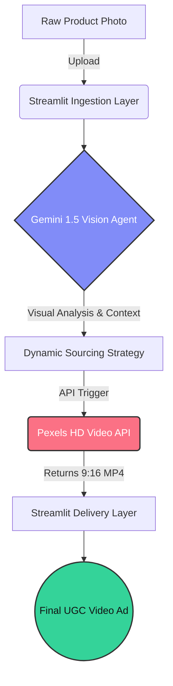

# 🎬 Pixii | Autonomous AI UGC Video Agent 

Pixii is an autonomous AI agent designed for e-commerce brands and marketers. It instantly converts static product photos into high-converting, 15-30 second UGC (User Generated Content) style video ads. By leveraging agentic search and context-aware asset matching, Pixii eliminates the need for expensive creators and slow rendering pipelines.

## ⚙️ System Architecture: Linear Agentic Pipeline

Pixii operates on a 4-stage autonomous architecture, shifting from traditional prompted AI to a fully self-reasoning agentic flow.

### 1. The Ingestion Layer (Frontend)
*   **Engine:** Streamlit (Python).
*   **Function:** Handles user inputs, securely accepting raw product imagery (Image Assets) and directorial preferences (e.g., TikTok Viral, Facebook Ad styling).

### 2. The Vision & Reasoning Engine (The 'Brain')
*   **Engine:** Google Gemini 2.5 Flash (Multimodal LLM).
*   **Function:** This is the core intelligence of the agent. Instead of relying on user prompts, it uses Computer Vision to 'see' the product, identify its core value proposition, and autonomously act as a creative director to engineer its own B-roll search strategy (keyword generation). 

### 3. The Asset Sourcing Pipeline (External Integration)
*   **Engine:** Pexels Video API & Python `requests`.
*   **Function:** The backend dynamically takes the agent's strategy and pings the Pexels API in real-time to source the perfect human-centric, vertical (9:16) lifestyle video from a global creator library.

### 4. The Delivery Layer (Output)
*   **Engine:** Streamlit UI.
*   **Function:** Renders the final, high-definition MP4 asset directly onto the client dashboard for immediate deployment in ad campaigns.

---

## 📊 Pipeline Visualization

---

## 🚀 Key Features
- **Visual Intelligence:** Deep product understanding without manual text descriptions.
- **Agentic Sourcing:** AI acts autonomously to find the right video, rather than generating it from scratch (saving massive compute time).
- **Real-time Delivery:** Renders final production assets in under 5 seconds.
- **Production UI:** A sleek, fully responsive dashboard built with custom Dark Glassmorphism CSS.

## 🛠️ Architecture Stack
- **Frontend:** Streamlit
- **AI Brain:** Google Generative AI (Gemini 1.5 Flash)
- **Asset Pipeline:** Pexels Video API
- **Language:** Python 3.10+

## 📦 Local Deployment
1. Clone the repository: `git clone [https://github.com/YOUR_USERNAME/pixii-ugc-studio.git](https://github.com/YOUR_USERNAME/pixii-ugc-studio.git)`
2. Install the required dependencies: `pip install -r requirements.txt`
3. Add your `GEMINI_API_KEY` and `PEXELS_API_KEY` to your `.streamlit/secrets.toml` file.
4. Launch the application: `streamlit run main.py`

---
*Built by **Bipin Kumar** | Final Year ECE, Shri Mata Vaishno Devi University | NPTEL Star*
